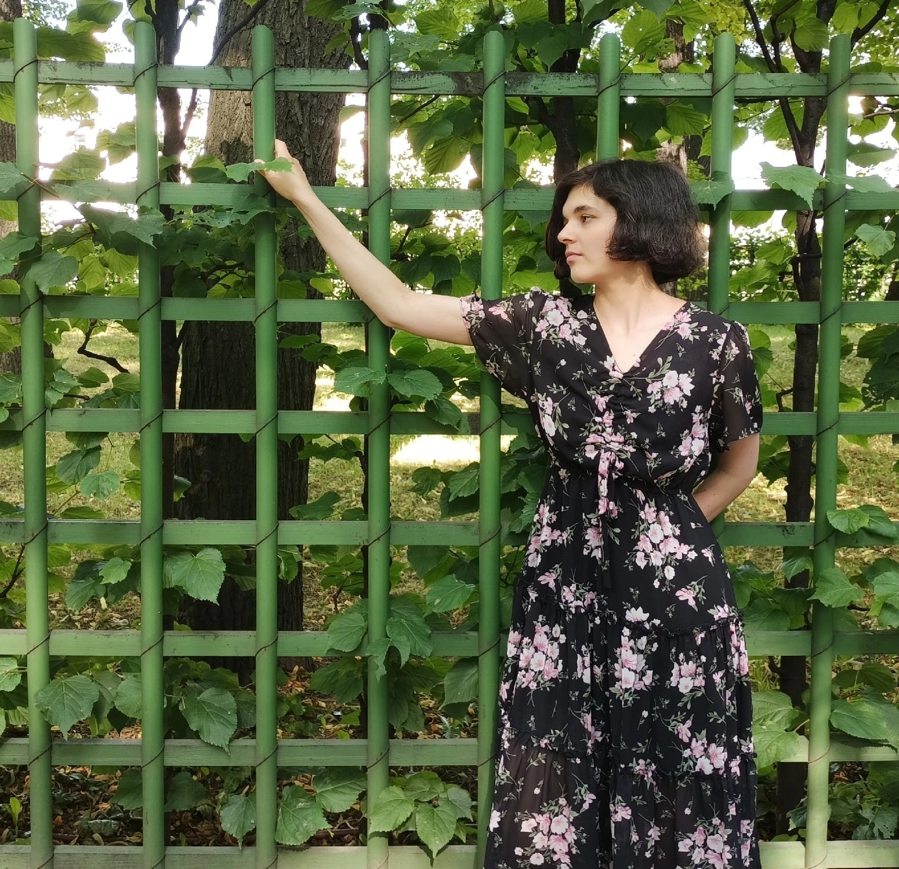

# Anastasiia Mamaeva

Hi! I am Anastasiia, a new MC's student in WIS in Life Science. I am pationat about implementing programming in wet biology to analyse data.
My pations lay in a field of protein-protein interactions.
--
You can find me in [Researcher Gate](https://www.researchgate.net/profile/Anastasiia-Mamaeva-2)
